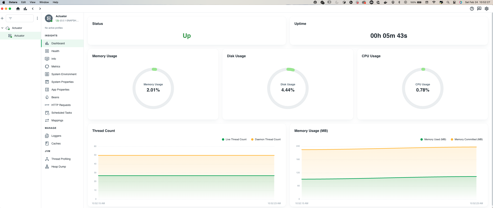
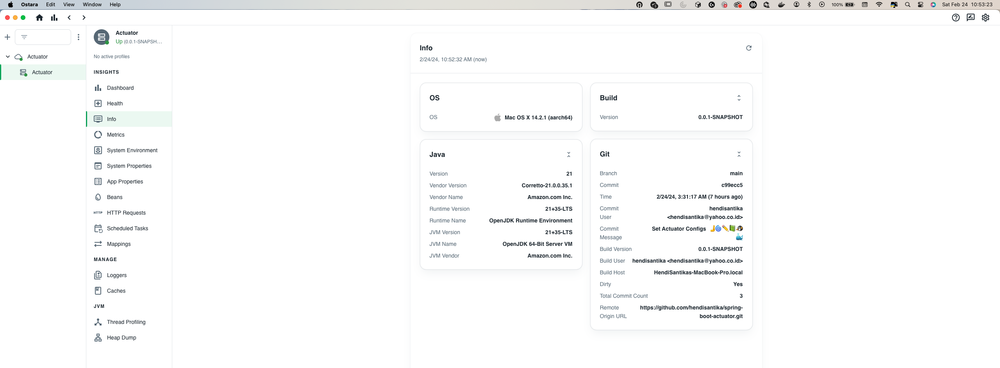

# spring-boot-actuator

### Things to do

1. Clone this repository: `git clone https://github.com/hendisantika/spring-boot-actuator.git`
2. Navigate to the folder: `cd spring-boot-actuator`
3. Run the application: `mvn clean spring-boot:run`
4. Open your favorite browser: http://localhost:8081/actuator

### Images Screen shot

Dashboard Page

Info Page

